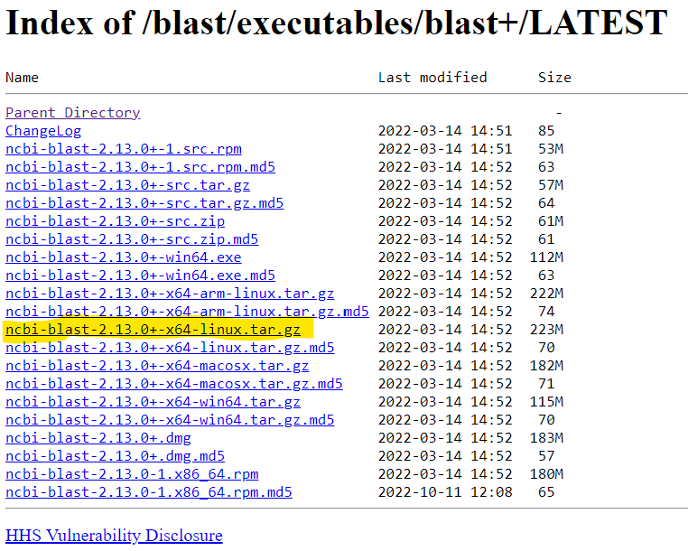

This assignment is to take set of unknown protein sequences, and annotate them with GO terms. What is a Gene Ontology (GO) term? 👀 see this [introduction to GO annotation](http://geneontology.org/docs/go-annotations/).

tl;dr: GO term annotation helps to answer questions like, 'What proteins are in the sample, and what do they do?"

> My Environment:
>
> -   Windows Surface Pro
>
> -   Chrome browser
>
> -   [JupyterHub Instance](https://jupyter.rttl.uw.edu/2023-spring-fish-546-a), remote RStudio server

### Step 1. Download Software

Open the remote RStudio server through [JupyterHub Instance](https://jupyter.rttl.uw.edu/2023-spring-fish-546-a){style="font-size: 11.4pt;"}.

Navigate to the [NCBI blast downloads](https://ftp.ncbi.nlm.nih.gov/blast/executables/blast+/LATEST/){style="font-size: 11.4pt;"} page, and copy [the link]{.underline} to the software ***for your operating system***. This is an important first step! Here I choose \`[ncbi-blast-2.13.0+-x64-linux.tar.gz](https://ftp.ncbi.nlm.nih.gov/blast/executables/blast+/LATEST/ncbi-blast-2.13.0+-x64-linux.tar.gz)\` because I am working in a Linux OS environment through the cloud instance of UW's JupyterHub, which operates a Linux OS.



We are going to first try to downloaded the [ncbi-blast-2.13.0+-x64-linux.tar.gz](https://ftp.ncbi.nlm.nih.gov/blast/executables/blast+/LATEST/ncbi-blast-2.13.0+-x64-linux.tar.gz) , and we'll do this not by 'clicking' on the file and downloading it locally to your computer, but by downloading it using the `curl -O` bash command and placing it in a new folder we'll create named 'applications' outside of the repository.

> Note: When you start a bash code chunk the present working directory always starts over in the location of the file that you are working from

```{bash}
# check present working directory
pwd
```

Download the software using `curl -O`

```{bash}
# navigate to outside of git repo directory using relative paths
cd ../../../../

# make application directory (will throw an error if already made once
# comment out `mkdir applications` if this is the case)
# mkdir applications

# switch into applications directory
cd applications

# curl (download from the internet) the NCBI software
curl -O https://ftp.ncbi.nlm.nih.gov/blast/executables/blast+/LATEST/ncbi-blast-2.13.0+-x64-linux.tar.gz

# tar unzip software with `tar -xf`
tar -xf ncbi-blast-2.13.0+-x64-linux.tar.gz
```

> Note: The `~` command specifies a file to run a program or command on... it does not change you to that directory space! The `-h` command displays help when placed after a specified file

```{bash}
~/applications/ncbi-blast-2.13.0+/bin/blastx -h
```

### Step 2. Make Blast Database

Before this step we want to make sure there is an assignments/data directory, and to add `assignments/data/*.f*` to the .gitignore file, since we will be downloading large fasta files to the folder, these files are too large to commit to GitHub (exceeding the max file size), and will result in errors if not included in the .gitignore file.

> Note: add `assignments/data/*.f*` to the .gitignore file

👀 see <https://www.uniprot.org/downloads>.

What is Swiss-Prot (sprot)? 👀 see [this](https://www.uniprot.org/help/uniprotkb_sections) info article.

```{bash}
# change into assignments/data directory
cd ../data

# download fasta.gz files from uniprot
curl -O https://ftp.uniprot.org/pub/databases/uniprot/current_release/knowledgebase/complete/uniprot_sprot.fasta.gz

# use the 'move' `mv` command to rename uniprot_sprot to include info on year & assignment number
mv uniprot_sprot.fasta.gz uniprot_sprot_r2023_01.fasta.gz

# unzip file (zipped by `gz`.. so unzip with `gunzip`..something something)
gunzip -k uniprot_sprot_r2023_01.fasta.gz

# list the files in the data directory to check that they are there with the right names
ls ../data
```

This code chunk will make the blast database.

> Note: add `assignments/blastdb` to the .gitignore file

```{bash}
# Use the ncbi-blast software 'makeblastdb' and run chain of commands to make a database using the fasta files in a new blastdb folder
~/applications/ncbi-blast-2.13.0+/bin/makeblastdb \
-in ../data/uniprot_sprot_r2023_01.fasta \
-dbtype prot \
-out ../blastdb/uniprot_sprot_r2023_01
```

### Step 3. Get Query Sequence

```{bash}
curl https://eagle.fish.washington.edu/cnidarian/Ab_4denovo_CLC6_a.fa \
-k \
>../data/Ab_4denovo_CLC6_a.fa
```

```{bash}
head ../data/Ab_4denovo_CLC6_a.fa
echo "How many sequences are there?"
grep -c ">" ../data/Ab_4denovo_CLC6_a.fa
```

### Step 4. Run Blast

This code chunk takes a very long time to run! May have to let it write to a file for a little while, then interrupt the code chunk by restarting R and moving on to the next step.

```{bash}
~/applications/ncbi-blast-2.13.0+/bin/blastx \
-query ../data/Ab_4denovo_CLC6_a.fa \
-db ../blastdb/uniprot_sprot_r2023_01 \
-out ../output/Ab_4-uniprot_blastx.tab \
-evalue 1E-20 \
# 16 because 16 CPU cores on my machine
-num_threads 16 \
-max_target_seqs 1 \
-outfmt 6
```

> Tip: run the head command to make sure there is an output.

```{bash}
head -2 ../output/Ab_4-uniprot_blastx.tab
wc -l ../output/Ab_4-uniprot_blastx.tab
```

Need to convert `sp|Q08013|SSRG_RAT` to get accession number out.

### Step 5. Getting More Information

First need to change format of blast output in bash...

```{bash}
tr '|' '\t' < ../output/Ab_4-uniprot_blastx.tab \
> ../output/Ab_4-uniprot_blastx_sep.tab
```

In R chunks...

Install packages

```{r}
install.packages(tidyverse)
install.packages("kableExtra")

```

Attach packages

```{r}
library(tidyverse)
library("kableExtra")
```

Read in data

```{r}
bltabl <- read.csv("../output/Ab_4-uniprot_blastx_sep.tab", sep = '\t', header = FALSE)

spgo <- read.csv("https://gannet.fish.washington.edu/seashell/snaps/uniprot_table_r2023_01.tab", sep = '\t', header = TRUE)
```

Check data

```{r}
head.matrix(spgo)
```

```{r}
str(bltabl)
```

### **Step 6. Joining blast table with annotation table**

At this point we have a blast output table (bltabl) and annotation table (spgo) both with a Uniprot accession number. Thus we can join the two tables and be able to get more functional information about the genes.

Join spgo and bltabl:

1.  join using left_join

```{r}
left_join(bltabl, spgo,  by = c("V3" = "Entry")) %>%
  select(V1, V3, V13, Protein.names, Organism, Gene.Ontology..biological.process., Gene.Ontology.IDs) %>% mutate(V1 = str_replace_all(V1, 
            pattern = "solid0078_20110412_FRAG_BC_WHITE_WHITE_F3_QV_SE_trimmed", replacement = "Ab")) %>%
  write_delim("../output/blast_annot_go.tab", delim = '\t')
```

2.  join using left_join and display using kbl

```{r echo=TRUE}
kbl(
head(
  left_join(bltabl, spgo,  by = c("V3" = "Entry")) %>%
  select(V1, V3, V13, Protein.names, Organism, Gene.Ontology..biological.process., Gene.Ontology.IDs) %>% mutate(V1 = str_replace_all(V1, 
            pattern = "solid0078_20110412_FRAG_BC_WHITE_WHITE_F3_QV_SE_trimmed", replacement = "Ab"))
)
) %>%
  kable_styling(bootstrap_options = c("striped", "hover", "condensed", "responsive"))
```

```{r echo=TRUE}
annot_tab <- read.csv("../output/blast_annot_go.tab", sep = '\t', header = TRUE)

kbl(
(annot_tab)
)%>%
  kable_styling(bootstrap_options = c("striped", "hover", "condensed", "responsive"))
```
