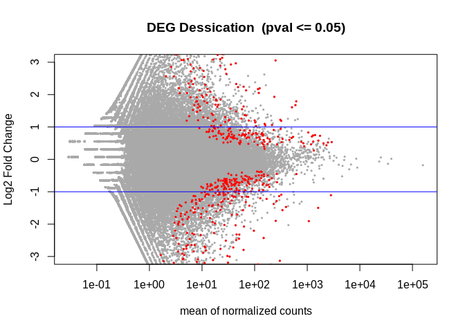

# Differential Gene Expression

<https://sr320.github.io/course-fish546-2023/assignments/02-DGE.html>

For this assignment you will be taking RNA-seq data, and running a common differential gene expression analysis, without the use of a reference genome. The end product will be a plot and table of deferentially expressed genes.

> Kallisto is a pseudo-aligner, it does not need a genome to align to! it uses the sequences in the dataset to create it's own 'reference'

------------------------------------------------------------------------

## Advance prep: Setup git hooks to automatically gitignore files \>100MB

In this assignment we're dealing with large files that will end up in the ../data and ../output directories. To prevent those large files from clogging up our ability to 'git push', we can use built-in hooks to automatically ignore files larger than 100 MB (no matter the directory or file name!). Here are the steps to follow:

-   Create a new text file in the .git/hooks/ directory of your repository called pre-commit. *Select the `More` tab with the gear icon under the RStudio Files navigator bar and select 'show hidden files' to see the .git folder*.

-   Add the following code to the pre-commit file:

<!-- -->

```         
#!/bin/bash

# Maximum file size (in bytes)
max_file_size=104857600

# Find all files larger than max_file_size and add them to the .gitignore file
find . -type f -size +$max_file_sizec -exec echo "{}" >> .gitignore \;
```

This code sets the max_file_size variable to 100 MB and then uses the find command to locate all files in the repository that are larger than the specified max_file_size. The exec option of the find command appends the name of each file that matches the criteria to the .gitignore file.

Save the pre-commit file and make it executable by running the following command in Terminal:

```         
chmod +x .git/hooks/pre-commit
```

With these changes, whenever you run a git commit command, Git will first execute the pre-commit hook, which will automatically add any files larger than 100 MB to the .gitignore file. This will prevent Git from tracking these files in the repository going forward.

## ⚠️In the event of a big (\>100MB) commit...

> In the event that you accidentally committed a file \>100MB, you can reset to the last successful git master branch push⚠️**! warning this will overwrite any changes you made after your last successful push !**⚠️...
>
> If you still want to continue, you can un-comment the code and follow <a href="#0"
> style="background-color: transparent; font-size: 11.4pt;">this</a> instruction:
>
> First, update all `origin/<branch>` refs to latest:
>
> ```         
> #git fetch --all
> ```
>
> Backup your current branch (e.g. `master`):
>
> ```         
> #git branch backup-master
> ```
>
> Jump to the latest commit on `origin/master` :
>
> ```         
> #git reset --hard origin/master
> ```

------------------------------------------------------------------------

## Running kallisto

[kallisto](https://pachterlab.github.io/kallisto/) is a software that can be downloaded and unzipped into a `programs` directory outside of the repo.

In our case, it is already installed on raven (`/home/shared/kallisto/kallisto`), and can be checked by running the `version` command as below:

```         
/home/shared/kallisto/kallisto version

## kallisto, version 0.46.1
```

> If you need to download and install kallisto:
>
> 1.  navigate to a `programs` directory outside of the repo
> 2.  grab the applicable program from the [website](https://pachterlab.github.io/kallisto/) using `wget`
> 3.  uncompress the file by navigating to the `programs/kallisto` directory and running `gunzip`
> 4.  check functionality with `index` command as above

------------------------------------------------------------------------

## Downloading Reference

This code grabs the Pacific oyster fasta file of genes and does so ignoring the fact that *gannet* does not have a security certificate to authenticate (`--insecure`). This is usually not recommended however we know the server (i.e. we trust we're not going to get a virus from this server).

```         
# change to work in data directory
cd ../data
# download the rna.fna file to data directory from the gannet server
curl --insecure -O https://gannet.fish.washington.edu/seashell/bu-github/nb-2023/Cgigas/data/rna.fna
```

In the next code chunk we create the index file which **insert what the index file is for here**. Creating the index file can take some time (it is 1.6GB!) This code is indexing the file `rna.fna` while also renaming it as `cgigas_roslin_rna.index`. `/home/shared/kallisto/kallisto` is the absolute path to kallisto program, while the lines after the `index` command indicate where to get the data from (the `rna.fna` file) and where to write the file to.

```         
/home/shared/kallisto/kallisto \
index -i \
../data/cgigas_roslin_rna.index \
../data/rna.fna
```

------------------------------------------------------------------------

## Download sequence reads

Sequence reads are on a public server at <https://gannet.fish.washington.edu/seashell/bu-github/nb-2023/Cgigas/data/nopp/> or located at absolute path `/home/shared/8TB_HDD_01/sr320/github/nb-2023/Cgigas/data`. This code uses the `--recursive` feature of `wget` to get all 24 files. Additionally as with `curl` above we are ignoring the fact there is not security certificate with `--no-check-certificate`

```         
# move to data directory
cd ../data 
# download fastq files to data directory 
wget --recursive --no-parent --no-directories \
--no-check-certificate \
--accept '*.fastq.gz' \
https://gannet.fish.washington.edu/seashell/bu-github/nb-2023/Cgigas/data/nopp/
```

Check to make sure all 24 files were downloaded successfully

```         
# move to data directory
cd ../data
# list all files that end with `.gz` extension, count the files in the list
ls *.gz | wc -l

## 24
```

The next chunk performs the following steps:

-   creates a subdirectory `kallisto_01` in the `output` folder using `mkdir`
-   Uses the `find` utility to search for all files in the `../data/` directory that match the pattern `*fastq.gz`.
-   Uses the `basename` command to extract the base filename of each file (i.e., the filename without the directory path), and removes the suffix `_L001_R1_001.fastq.gz`.
-   Runs the kallisto `quant` command on each input file, with the following options:
-   `-i ../data/cgigas_roslin_rna.index`: Use the kallisto index file located at `../data/cgigas_roslin_rna.index`.
-   `-o ../output/kallisto_01/{}`: Write the output files to a directory called `../output/kallisto_01/` with a subdirectory named after the base filename of the input file (the {} is a placeholder for the base filename).
-   `-t 40`: Use 40 threads for the computation.
-   `--single -l 100 -s 10`: Specify that the input file contains single-end reads (--single), with an average read length of 100 (-l 100) and a standard deviation of 10 (-s 10).
-   The input file to process is specified using the {} placeholder, which is replaced by the base filename from the previous step.

<!-- -->

```         
# mkdir ../output/kallisto_01

find ../data/*fastq.gz \
| xargs basename -s _L001_R1_001.fastq.gz | xargs -I{} /home/shared/kallisto/kallisto \
quant -i ../data/cgigas_roslin_rna.index \
-o ../output/kallisto_01/{} \
-t 40 \
--single -l 100 -s 10 ../data/{}_L001_R1_001.fastq.gz
```

This next command runs the `abundance_estimates_to_matrix.pl` script from the Trinity RNA-seq assembly software package to create a gene expression matrix from kallisto output files.

The specific options and arguments used in the command are as follows:

-   `perl /home/shared/trinityrnaseq-v2.12.0/util/abundance_estimates_to_matrix.pl`: Run the abundance_estimates_to_matrix.pl script from Trinity.
-   `--est_method kallisto`: Specify that the abundance estimates were generated using kallisto.
-   `--gene_trans_map none`: Do not use a gene-to-transcript mapping file.
-   `--out_prefix ../output/kallisto_01`: Use ../output/kallisto_01 as the output directory and prefix for the gene expression matrix file.
-   `--name_sample_by_basedir`: Use the sample directory name (i.e., the final directory in the input file paths) as the sample name in the output matrix.
-   And then there are the kallisto abundance files to use as input for creating the gene expression matrix.

<!-- -->

```         
perl /home/shared/trinityrnaseq-v2.12.0/util/abundance_estimates_to_matrix.pl \
--est_method kallisto \
    --gene_trans_map none \
    --out_prefix ../output/kallisto_01 \
    --name_sample_by_basedir \
    ../output/kallisto_01/D54_S145/abundance.tsv \
    ../output/kallisto_01/D56_S136/abundance.tsv \
    ../output/kallisto_01/D58_S144/abundance.tsv \
    ../output/kallisto_01/M45_S140/abundance.tsv \
    ../output/kallisto_01/M48_S137/abundance.tsv \
    ../output/kallisto_01/M89_S138/abundance.tsv \
    ../output/kallisto_01/D55_S146/abundance.tsv \
    ../output/kallisto_01/D57_S143/abundance.tsv \
    ../output/kallisto_01/D59_S142/abundance.tsv \
    ../output/kallisto_01/M46_S141/abundance.tsv \
    ../output/kallisto_01/M49_S139/abundance.tsv \
    ../output/kallisto_01/M90_S147/abundance.tsv \
    ../output/kallisto_01/N48_S194/abundance.tsv \
    ../output/kallisto_01/N50_S187/abundance.tsv \
    ../output/kallisto_01/N52_S184/abundance.tsv \
    ../output/kallisto_01/N54_S193/abundance.tsv \
    ../output/kallisto_01/N56_S192/abundance.tsv \
    ../output/kallisto_01/N58_S195/abundance.tsv \
    ../output/kallisto_01/N49_S185/abundance.tsv \
    ../output/kallisto_01/N51_S186/abundance.tsv \
    ../output/kallisto_01/N53_S188/abundance.tsv \
    ../output/kallisto_01/N55_S190/abundance.tsv \
    ../output/kallisto_01/N57_S191/abundance.tsv \
    ../output/kallisto_01/N59_S189/abundance.tsv
    
```

------------------------------------------------------------------------

## **Running DESeq2**

This code performs differential expression analysis to identify deferentially expressed genes (DEGs) between a control condition and a desiccated condition.

First, it reads in a count matrix of isoform counts generated by `kallisto`, with row names set to the gene/transcript IDs and the first column removed. It then rounds the counts to whole numbers.

Next, it creates a `data.frame` containing information about the experimental conditions and sets row names to match the column names in the count matrix. It uses this information to create a `DESeqDataSet` object, which is then passed to the `DESeq()` function to fit a negative binomial model and estimate dispersions. The `results()` function is used to extract the results table, which is ordered by gene/transcript ID.

The code then prints the top few rows of the results table and calculates the number of DEGs with an adjusted p-value less than or equal to 0.05. It plots the log2 fold changes versus the mean normalized counts for all genes, highlighting significant DEGs in red and adding horizontal lines at 2-fold upregulation and downregulation. Finally, it writes the list of significant DEGs to a file called "DEGlist.tab".

If needed, install packages

```         
if (!require("BiocManager", quietly = TRUE))
    install.packages("BiocManager")

BiocManager::install("DESeq2")
```

Load packages

```         
library(DESeq2)

## Loading required package: S4Vectors

## Loading required package: stats4

## Loading required package: BiocGenerics

## 
## Attaching package: 'BiocGenerics'

## The following objects are masked from 'package:stats':
## 
##     IQR, mad, sd, var, xtabs

## The following objects are masked from 'package:base':
## 
##     anyDuplicated, aperm, append, as.data.frame, basename, cbind,
##     colnames, dirname, do.call, duplicated, eval, evalq, Filter, Find,
##     get, grep, grepl, intersect, is.unsorted, lapply, Map, mapply,
##     match, mget, order, paste, pmax, pmax.int, pmin, pmin.int,
##     Position, rank, rbind, Reduce, rownames, sapply, setdiff, sort,
##     table, tapply, union, unique, unsplit, which.max, which.min

## 
## Attaching package: 'S4Vectors'

## The following objects are masked from 'package:base':
## 
##     expand.grid, I, unname

## Loading required package: IRanges

## Loading required package: GenomicRanges

## Loading required package: GenomeInfoDb

## Loading required package: SummarizedExperiment

## Loading required package: MatrixGenerics

## Loading required package: matrixStats

## 
## Attaching package: 'MatrixGenerics'

## The following objects are masked from 'package:matrixStats':
## 
##     colAlls, colAnyNAs, colAnys, colAvgsPerRowSet, colCollapse,
##     colCounts, colCummaxs, colCummins, colCumprods, colCumsums,
##     colDiffs, colIQRDiffs, colIQRs, colLogSumExps, colMadDiffs,
##     colMads, colMaxs, colMeans2, colMedians, colMins, colOrderStats,
##     colProds, colQuantiles, colRanges, colRanks, colSdDiffs, colSds,
##     colSums2, colTabulates, colVarDiffs, colVars, colWeightedMads,
##     colWeightedMeans, colWeightedMedians, colWeightedSds,
##     colWeightedVars, rowAlls, rowAnyNAs, rowAnys, rowAvgsPerColSet,
##     rowCollapse, rowCounts, rowCummaxs, rowCummins, rowCumprods,
##     rowCumsums, rowDiffs, rowIQRDiffs, rowIQRs, rowLogSumExps,
##     rowMadDiffs, rowMads, rowMaxs, rowMeans2, rowMedians, rowMins,
##     rowOrderStats, rowProds, rowQuantiles, rowRanges, rowRanks,
##     rowSdDiffs, rowSds, rowSums2, rowTabulates, rowVarDiffs, rowVars,
##     rowWeightedMads, rowWeightedMeans, rowWeightedMedians,
##     rowWeightedSds, rowWeightedVars

## Loading required package: Biobase

## Welcome to Bioconductor
## 
##     Vignettes contain introductory material; view with
##     'browseVignettes()'. To cite Bioconductor, see
##     'citation("Biobase")', and for packages 'citation("pkgname")'.

## 
## Attaching package: 'Biobase'

## The following object is masked from 'package:MatrixGenerics':
## 
##     rowMedians

## The following objects are masked from 'package:matrixStats':
## 
##     anyMissing, rowMedians

library(tidyverse)

## ── Attaching core tidyverse packages ──────────────────────── tidyverse 2.0.0 ──
## ✔ dplyr     1.1.1     ✔ readr     2.1.4
## ✔ forcats   1.0.0     ✔ stringr   1.5.0
## ✔ ggplot2   3.4.1     ✔ tibble    3.2.1
## ✔ lubridate 1.9.2     ✔ tidyr     1.3.0
## ✔ purrr     1.0.1

## ── Conflicts ────────────────────────────────────────── tidyverse_conflicts() ──
## ✖ lubridate::%within%() masks IRanges::%within%()
## ✖ dplyr::collapse()     masks IRanges::collapse()
## ✖ dplyr::combine()      masks Biobase::combine(), BiocGenerics::combine()
## ✖ dplyr::count()        masks matrixStats::count()
## ✖ dplyr::desc()         masks IRanges::desc()
## ✖ tidyr::expand()       masks S4Vectors::expand()
## ✖ dplyr::filter()       masks stats::filter()
## ✖ dplyr::first()        masks S4Vectors::first()
## ✖ dplyr::lag()          masks stats::lag()
## ✖ ggplot2::Position()   masks BiocGenerics::Position(), base::Position()
## ✖ purrr::reduce()       masks GenomicRanges::reduce(), IRanges::reduce()
## ✖ dplyr::rename()       masks S4Vectors::rename()
## ✖ lubridate::second()   masks S4Vectors::second()
## ✖ lubridate::second<-() masks S4Vectors::second<-()
## ✖ dplyr::slice()        masks IRanges::slice()
## ℹ Use the conflicted package (<http://conflicted.r-lib.org/>) to force all conflicts to become errors

library(pheatmap)
library(RColorBrewer)
library(data.table)

## 
## Attaching package: 'data.table'
## 
## The following objects are masked from 'package:lubridate':
## 
##     hour, isoweek, mday, minute, month, quarter, second, wday, week,
##     yday, year
## 
## The following objects are masked from 'package:dplyr':
## 
##     between, first, last
## 
## The following object is masked from 'package:purrr':
## 
##     transpose
## 
## The following object is masked from 'package:SummarizedExperiment':
## 
##     shift
## 
## The following object is masked from 'package:GenomicRanges':
## 
##     shift
## 
## The following object is masked from 'package:IRanges':
## 
##     shift
## 
## The following objects are masked from 'package:S4Vectors':
## 
##     first, second
```

Read in count matrix

```         
countmatrix <- read.delim("../output/kallisto_01.isoform.counts.matrix", header = TRUE, sep = '\t')
rownames(countmatrix) <- countmatrix$X
countmatrix <- countmatrix[,-1]
head(countmatrix)

##                D54_S145 D56_S136 D58_S144 M45_S140 M48_S137 M89_S138 D55_S146
## XM_011445263.3   3.0000   6.0000  3.00000  6.00000  15.0000  6.00000   5.0000
## XR_004600192.1   0.0000   0.0000  5.58188  0.00000   0.0000  0.00000   0.0000
## XM_034469868.1  65.9994  65.9996 48.00000 51.99950  60.9995 51.99950  68.9997
## XM_034479134.1   0.0000   0.0000  0.00000  0.00000   0.0000  0.00000   0.0000
## XM_034446498.1   0.0000   0.0000  0.00000  0.00000   0.0000 20.77020   0.0000
## XM_034459635.1   0.0000   4.0000  1.00000  0.16843   0.0000  3.73389   0.0000
##                D57_S143 D59_S142 M46_S141 M49_S139    M90_S147 N48_S194
## XM_011445263.3  12.0000   6.0000   3.0000  3.00000 8.000000000   3.0000
## XR_004600192.1   0.0000   0.0000   0.0000  0.00000 1.129220000   1.0000
## XM_034469868.1  59.9994  42.9998  50.9997  5.31287 0.000298258  63.9995
## XM_034479134.1   0.0000   0.0000   0.0000  0.00000 0.000000000   0.0000
## XM_034446498.1   0.0000   0.0000   0.0000  0.00000 0.000000000   0.0000
## XM_034459635.1   0.0000   0.0000   1.0000  1.00000 0.000000000   0.0000
##                N50_S187 N52_S184 N54_S193 N56_S192 N58_S195 N49_S185 N51_S186
## XM_011445263.3   6.0000   2.0000  4.00000        1    9.000   8.0000    2.000
## XR_004600192.1   0.0000   0.0000  5.58188        0    0.000   0.0000    4.000
## XM_034469868.1  74.9993  64.9997 39.99960        0  118.999  88.9993  138.998
## XM_034479134.1   0.0000   0.0000  0.00000        0    0.000   0.0000    0.000
## XM_034446498.1   0.0000   2.0000  0.00000        0    0.000   0.0000    0.000
## XM_034459635.1   0.0000   0.0000  0.00000        0    0.000   0.0000    0.000
##                N53_S188 N55_S190 N57_S191 N59_S189
## XM_011445263.3   7.0000   2.0000   4.0000  6.00000
## XR_004600192.1   0.0000   0.0000   0.0000  4.07503
## XM_034469868.1  80.9993  59.9996  24.9999 40.99970
## XM_034479134.1   0.0000   0.0000   0.0000  0.00000
## XM_034446498.1   0.0000   0.0000   0.0000  0.00000
## XM_034459635.1   0.0000   0.0000   1.0000  0.00000
```

Round integers up to whole numbers for analysis

```         
countmatrix <- round(countmatrix, 0)
str(countmatrix)

## 'data.frame':    73307 obs. of  24 variables:
##  $ D54_S145: num  3 0 66 0 0 0 3 0 0 0 ...
##  $ D56_S136: num  6 0 66 0 0 4 0 73 0 0 ...
##  $ D58_S144: num  3 6 48 0 0 1 0 74 0 0 ...
##  $ M45_S140: num  6 0 52 0 0 0 0 0 0 0 ...
##  $ M48_S137: num  15 0 61 0 0 0 0 49 0 0 ...
##  $ M89_S138: num  6 0 52 0 21 4 0 70 0 0 ...
##  $ D55_S146: num  5 0 69 0 0 0 0 85 0 0 ...
##  $ D57_S143: num  12 0 60 0 0 0 0 50 0 0 ...
##  $ D59_S142: num  6 0 43 0 0 0 0 57 0 0 ...
##  $ M46_S141: num  3 0 51 0 0 1 3 67 0 0 ...
##  $ M49_S139: num  3 0 5 0 0 1 0 68 0 0 ...
##  $ M90_S147: num  8 1 0 0 0 0 0 65 0 0 ...
##  $ N48_S194: num  3 1 64 0 0 0 7 18 0 0 ...
##  $ N50_S187: num  6 0 75 0 0 0 0 50 0 0 ...
##  $ N52_S184: num  2 0 65 0 2 0 0 59 0 0 ...
##  $ N54_S193: num  4 6 40 0 0 0 0 72 0 0 ...
##  $ N56_S192: num  1 0 0 0 0 0 0 0 0 0 ...
##  $ N58_S195: num  9 0 119 0 0 0 6 0 0 0 ...
##  $ N49_S185: num  8 0 89 0 0 0 0 50 0 0 ...
##  $ N51_S186: num  2 4 139 0 0 0 13 0 0 0 ...
##  $ N53_S188: num  7 0 81 0 0 0 0 56 0 0 ...
##  $ N55_S190: num  2 0 60 0 0 0 0 0 0 0 ...
##  $ N57_S191: num  4 0 25 0 0 1 0 62 0 0 ...
##  $ N59_S189: num  6 4 41 0 0 0 0 47 0 0 ...
```

Get DEGs based on dessication

```         
deseq2.colData <- data.frame(condition=factor(c(rep("control", 12), rep("desicated", 12))), 
                             type=factor(rep("single-read", 24)))
rownames(deseq2.colData) <- colnames(data)
deseq2.dds <- DESeqDataSetFromMatrix(countData = countmatrix,
                                     colData = deseq2.colData, 
                                     design = ~ condition)

## converting counts to integer mode

deseq2.dds <- DESeq(deseq2.dds)

## estimating size factors

## estimating dispersions

## gene-wise dispersion estimates

## mean-dispersion relationship

## final dispersion estimates

## fitting model and testing

## -- replacing outliers and refitting for 5677 genes
## -- DESeq argument 'minReplicatesForReplace' = 7 
## -- original counts are preserved in counts(dds)

## estimating dispersions

## fitting model and testing

deseq2.res <- results(deseq2.dds)
deseq2.res <- deseq2.res[order(rownames(deseq2.res)), ]

head(deseq2.res)

## log2 fold change (MLE): condition desicated vs control 
## Wald test p-value: condition desicated vs control 
## DataFrame with 6 rows and 6 columns
##                  baseMean log2FoldChange     lfcSE      stat      pvalue
##                 <numeric>      <numeric> <numeric> <numeric>   <numeric>
## NM_001305288.1   0.181270      1.0453698  3.002647  0.348149 7.27728e-01
## NM_001305289.1   0.881457     -2.8119577  1.068276 -2.632239 8.48240e-03
## NM_001305290.1 145.913728      0.4580323  0.116185  3.942251 8.07203e-05
## NM_001305291.1   0.261701      0.5618449  1.587076  0.354013 7.23329e-01
## NM_001305292.1   2.902430     -1.2181330  0.763421 -1.595624 1.10573e-01
## NM_001305293.1 234.342117      0.0663449  0.131969  0.502731 6.15154e-01
##                      padj
##                 <numeric>
## NM_001305288.1         NA
## NM_001305289.1         NA
## NM_001305290.1 0.00956401
## NM_001305291.1         NA
## NM_001305292.1 0.59541971
## NM_001305293.1 0.95562321
```

Count number of hits with adjusted p-value less then 0.05

```         
dim(deseq2.res[!is.na(deseq2.res$padj) & deseq2.res$padj <= 0.05, ])

## [1] 607   6
```

Make plots

```         
tmp <- deseq2.res
# The main plot
plot(tmp$baseMean, tmp$log2FoldChange, pch=20, cex=0.45, ylim=c(-3, 3), log="x", col="darkgray",
     main="DEG Dessication  (pval <= 0.05)",
     xlab="mean of normalized counts",
     ylab="Log2 Fold Change")

## Warning in xy.coords(x, y, xlabel, ylabel, log): 16484 x values <= 0 omitted
## from logarithmic plot

# Getting the significant points and plotting them again so they're a different color
tmp.sig <- deseq2.res[!is.na(deseq2.res$padj) & deseq2.res$padj <= 0.05, ]
points(tmp.sig$baseMean, tmp.sig$log2FoldChange, pch=20, cex=0.45, col="red")
# 2 FC lines
abline(h=c(-1,1), col="blue")
```

 Write output to table

```         
write.table(tmp.sig, "../output/DEGlist.tab", row.names = T)
```
