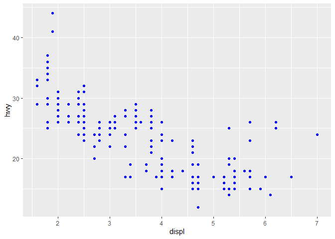

# Week 03 Questions

### **11APR2023, Sarah Tanja**

    library(tidyverse)

**a. An R Markdown file is plain text file that contains what 3 important types of content?**

1.  An (optional) YAML header surrounded by `--- .`
2.  Chunks of `R code` surrounded by \`\`\` .
3.  Text mixed with simple text formatting like \# headings, **bold**, and *italics*.

> from [R for Data Science, Chapter 27](https://r4ds.had.co.nz/r-markdown.html)

**b. What is a chunk and how do you add them? of the many chunk options which one do you think you will use the most and why? How is inline code different than code chunks?**

A chunk is a mini coding window. You can add them to RMarkdown documents via 1. keyboard shortcut (for example `Cmd/Ctrl + Alt + i` inserts an `R` code chunk), 2. the "insert" button in the editor toolbar, 3. manually typing \`\`\`{r} \`\`\` (or replace `r` with `bash` for a different code language) to render:

**c. What's gone wrong with this code? Why are the points not blue?**

    ggplot(data = mpg) + 
        geom_point(mapping = aes(x = displ, y = hwy, color = "blue"))

The points are not blue because inside the aesthetics function aes(), you are mapping an aesthetic characteristic of a graph (like the x axis, the y axis, the size, shape, and color of the points) to a **variable** in the data frame... "blue" is not a variable in the `mpg` data frame. A variable that you can map to the points would look like:

    ggplot(data = mpg) + 
        geom_point(mapping = aes(x = displ, y = hwy, color = class))

If you want the points to be blue, you add that code outside of the aes() function, but wrapped inside the mapping() function as below:

    ggplot(data = mpg) + 
        geom_point(mapping = aes(x = displ, y = hwy), color = "blue")

> from [R for Data Science, Chapter 3](https://r4ds.had.co.nz/data-visualisation.html)

**d. Of the many things we have done in class the past two weeks, what is one aspect you would like to revisit and spend more time on?** RNAseq, looking at the data output and interpreting what we see, or modifying the visualizations to show certain relationships or patterns in gene expression. We used kallisto to run a differential gene expression analysis on two treatments and create a plot and table of differentially expressed genes. I'd like to learn more about 1. how to highlight the patterns in gene expression in visualizations and 2. how to map RNAseq data to a known genome.
